# SOC & Phishing Lab: Deploying Splunk SIEM and Investigating a Simulated Attack Chain on TryHackMe

**Tools:** Splunk Enterprise 10.4.0 · Splunk Universal Forwarder · Ubuntu · Windows 11 · TryHackMe SOC Simulator (Phishing Unfolding – Medium)

**Skills Demonstrated:** SIEM deployment · Log ingestion · Windows telemetry · Alert triage · Phishing analysis · Process anomaly detection · DNS tunnelling identification · Incident reporting

**Result:** 1,425 pts · 100% True Positive Rate · 95% False Positive Accuracy · 35 alerts closed

---

## Overview

This report documents the setup of a local SIEM environment using Splunk Enterprise on Ubuntu, the connection of a Windows 11 endpoint as a log source via the Splunk Universal Forwarder, and the completion of TryHackMe's SOC Immersive Simulator — **Phishing Unfolding** (Medium difficulty). The simulation presented 35 alerts across phishing, PowerShell execution, suspicious process relationships, network drive staging, and DNS-based data exfiltration. The report covers the technical configuration steps, the alert investigation methodology, and the findings from each notable alert category.

> Parts 1–3 document an independent Splunk lab build on my own Ubuntu/Windows 11 setup. Part 4 uses TryHackMe's separate hosted Splunk instance and simulated attack scenario, since replicating a genuine multi-stage attack chain isn't something a solo home lab can realistically generate. Both sections use the same underlying tool (Splunk) and skill set.

---

## Architecture
 
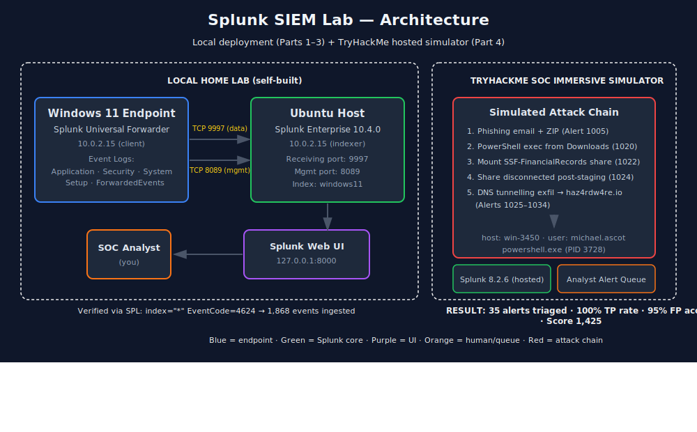
**Diagram 1: Lab Architecture**
 
---

## Part 1 — Environment Setup

### System Preparation

The Ubuntu host was updated and required packages installed before any Splunk configuration:

```bash
sudo apt update && sudo apt upgrade -y
sudo apt install curl wget python3 -y
```

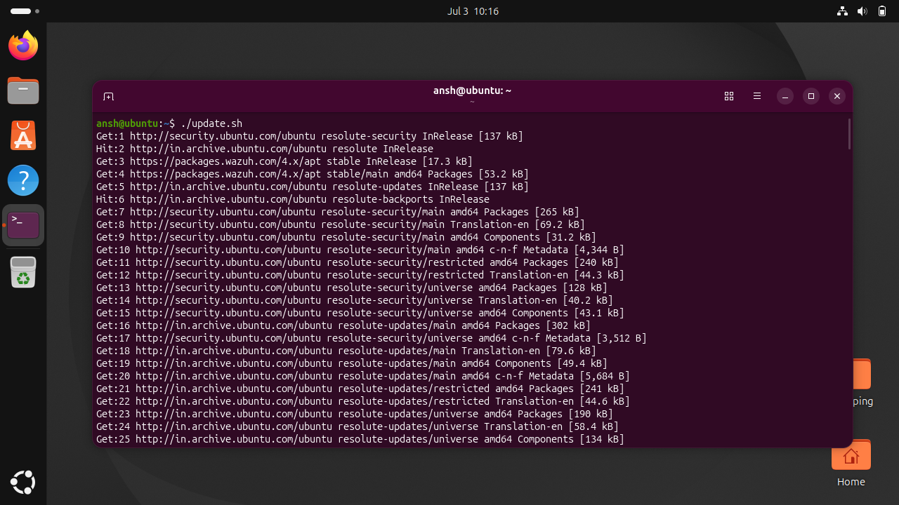
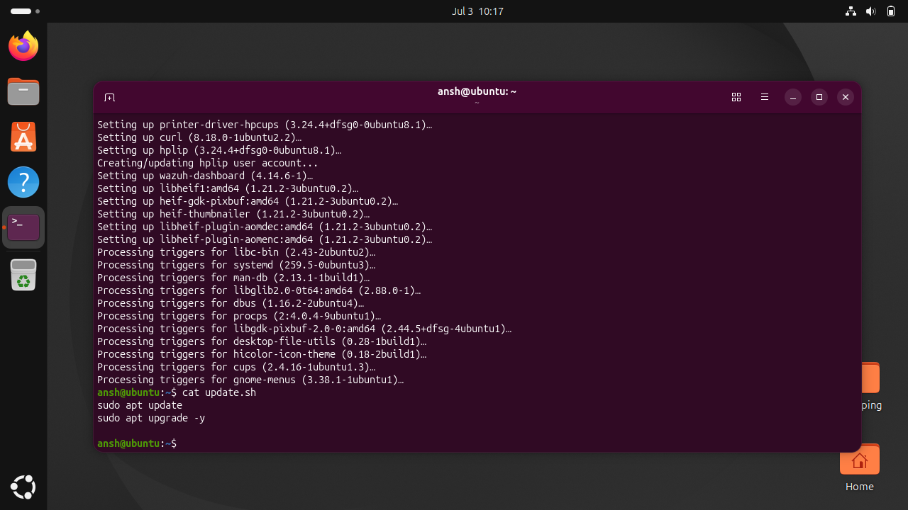

To determine the host IP address for later forwarder configuration, net-tools was installed and `ifconfig` run:

```bash
ifconfig
```

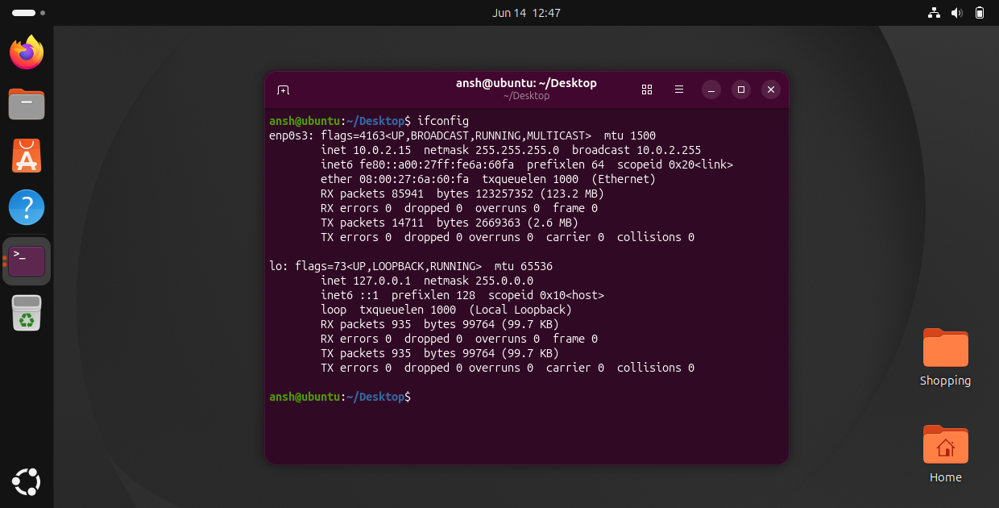

This returned `inet 10.0.2.15` on interface `enp0s3` — the address the Windows Universal Forwarder would use to reach the Splunk indexer.

---

## Part 2 — Splunk Enterprise Installation on Ubuntu

### 2.1 Installation

Splunk Enterprise 10.4.0 was downloaded from Splunk's official download portal and installed using the Debian package manager:

```bash
sudo dpkg -i splunk-10.4.0-f798d4d49089-linux-amd64.deb
```

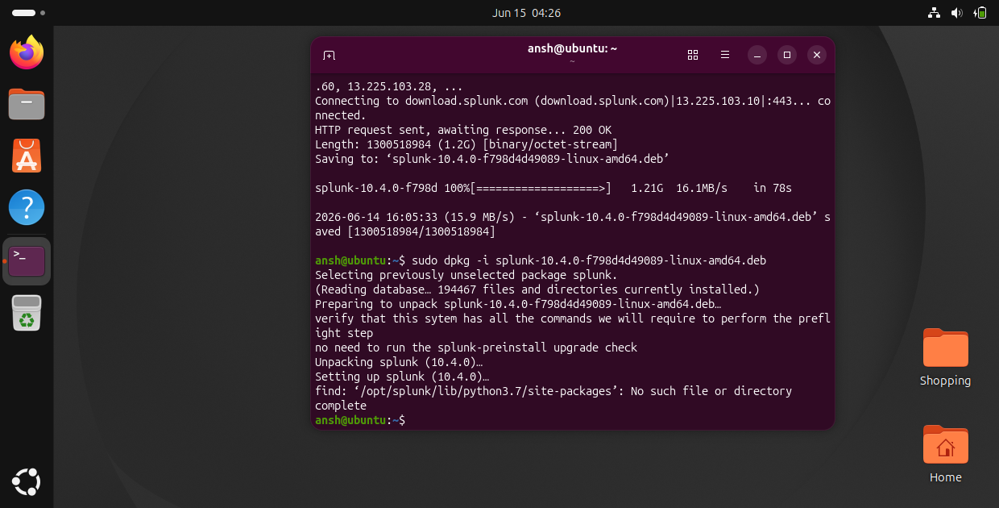

The installer extracts Splunk to `/opt/splunk/`. The service was then started:

```bash
sudo /opt/splunk/bin/splunk start --run-as-root
```

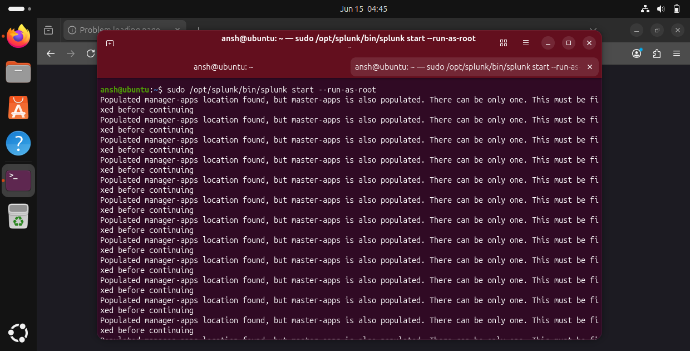

On first start, this is a common first-run warning caused by both app directories being populated by default. It's addressed in Splunk community documentation, and resolving it is a standard step in single-instance setups that aren't intended as deployment servers or cluster managers.

### 2.2 Web Interface Access

With the service running, the Splunk web interface was accessible at `http://127.0.0.1:8000`. Login was done using the admin credentials set during the initial start sequence.

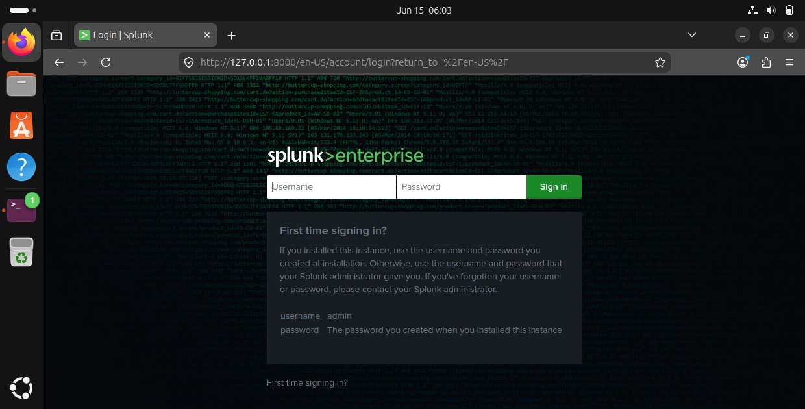

After logging in, the home dashboard confirmed a clean deployment: Search & Reporting, Audit Trail, and Data Management apps visible, logged in as Administrator.

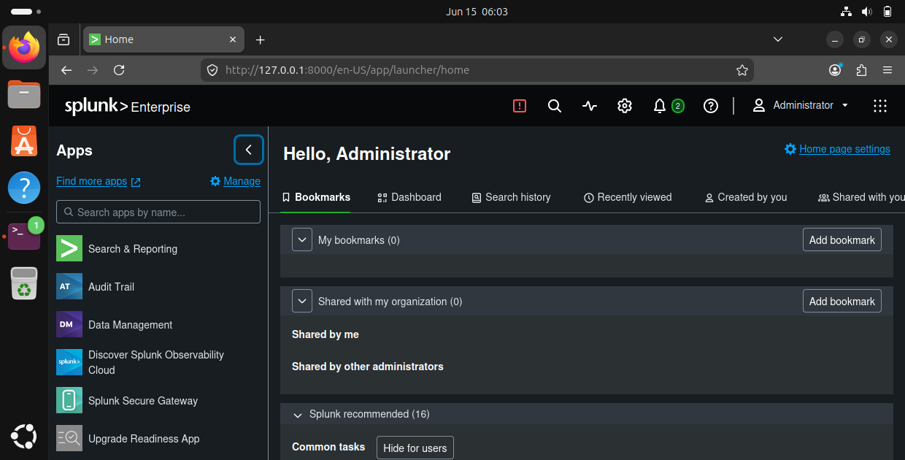

### 2.3 Receiving Port Configuration

To accept log data forwarded from endpoints, Splunk was configured to listen on the standard receiving port:

1. Settings → Forwarding and Receiving
2. Receive Data → Configure receiving → Add new
3. Port: `9997`

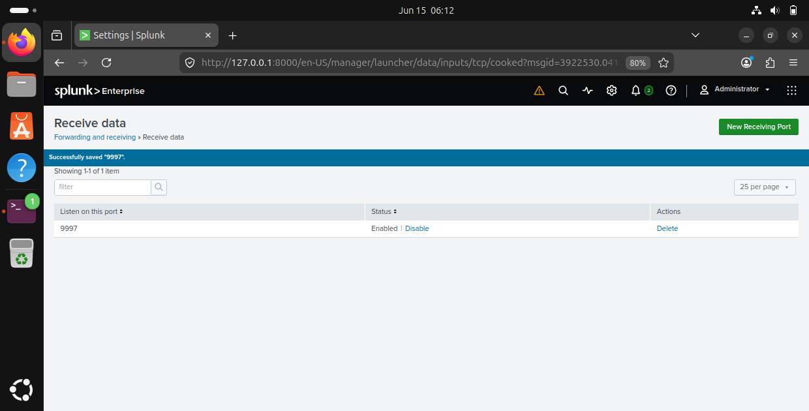

Splunk confirmed the configuration with: *"Successfully saved '9997'"*. Port 9997 is the conventional Splunk-to-Splunk data channel.

### 2.4 Index Creation

A dedicated index was created to isolate Windows endpoint telemetry from other data sources:

1. Settings → Indexes → New Index
2. Name: `windows11`
3. Index data type: Events

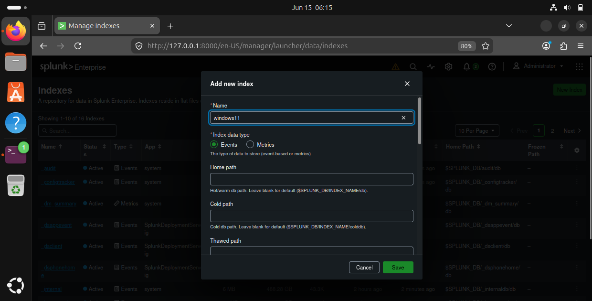

The Manage Indexes screen confirmed the `windows11` index among 16 active indexes.

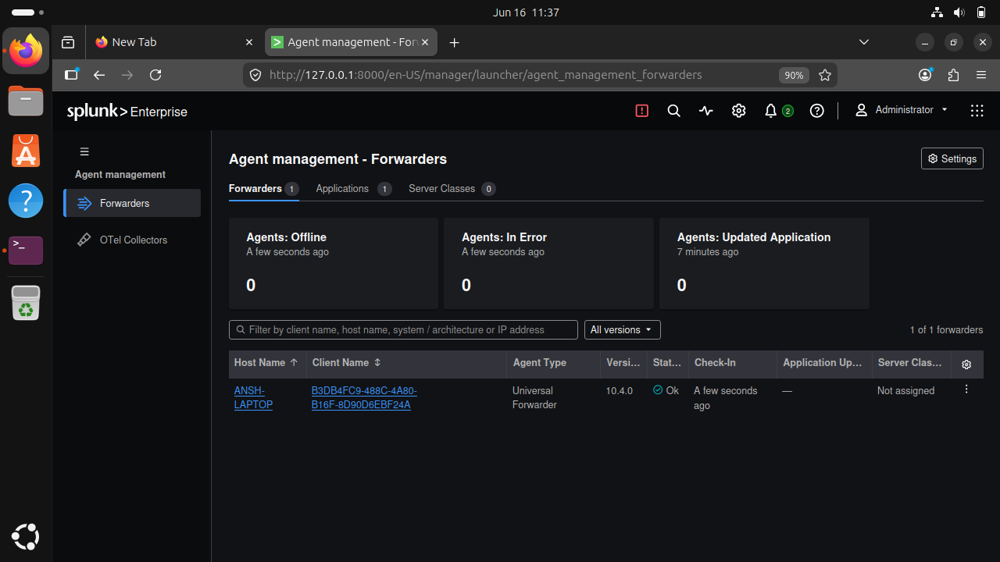

Scoping data to a named index keeps searches efficient and prevents Windows event data from being conflated with other log sources in the environment.

---

## Part 3 — Splunk Universal Forwarder on Windows 11


**Diagram 2: Lab Pipeline Diagram**

---

### 3.1 Installation and Configuration

The Splunk Universal Forwarder is a lightweight agent that collects and forwards log data to a Splunk indexer. It runs as a Windows service and does not perform any local indexing or searching. The Windows 64-bit `.msi` installer was downloaded from splunk.com and configured during setup as follows:

| Setting | Value |
|---|---|
| Server IP | 10.0.2.15 (Ubuntu host) |
| Management Port | 8089 |
| Receiving Port | 9997 |
| Admin credentials | Matching Splunk Enterprise credentials |

Port 8089 handles the management channel — registration, configuration, and heartbeat between forwarder and indexer. Port 9997 is the data channel over which log events are transmitted.

### 3.2 Selecting Windows Event Log Sources

Via **Add Data → Select Forwarders → Select Source → Local Event Logs**, all available Windows Event Log channels were selected:

- **Application** — crashes, service errors, application events
- **Security** — authentication, privilege use, account changes (the most critical for SOC work)
- **System** — OS-level events, hardware, drivers
- **Setup** — Windows Update and configuration events
- **ForwardedEvents** — events forwarded from other systems

The Security channel is the most operationally relevant for SOC work, containing events such as logon activity (4624, 4625), process creation (4688), and privilege escalation.

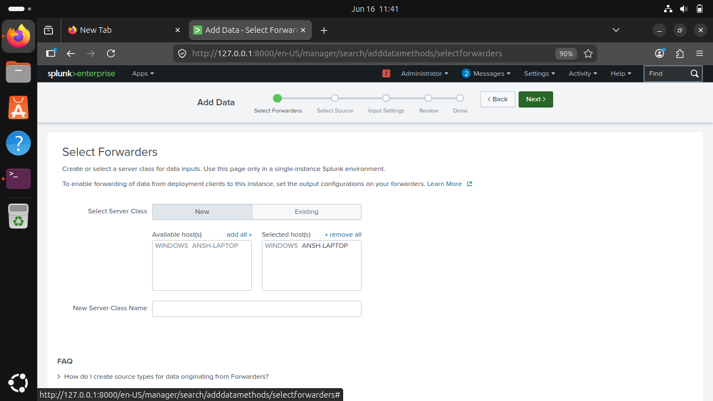
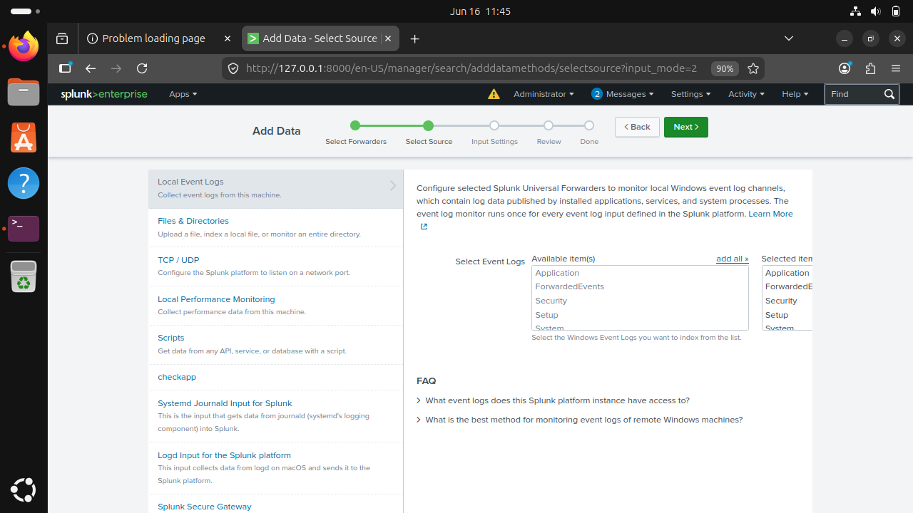

**Input Settings:** Index set to `windows11`

**Review screen** confirmed the full configuration:

- Server Class: `Ansh`
- Forwarder: `WINDOWS | ANSH-LAPTOP`
- Input Type: Windows Event Logs
- All five channels selected
- Index: `windows11`

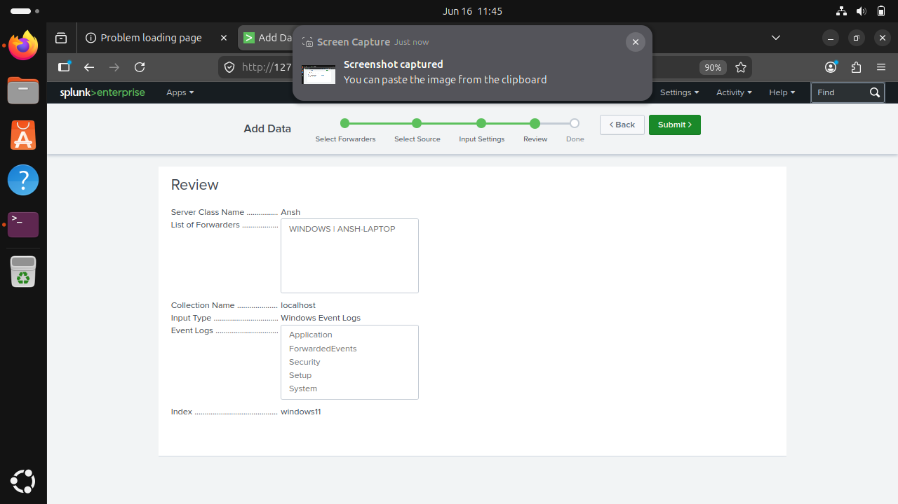

Splunk confirmed: **"Local event logs input has been created successfully."**

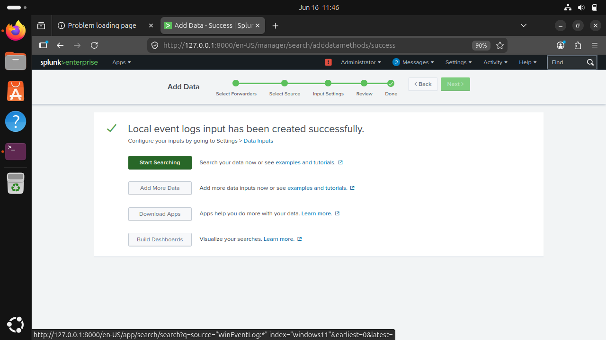

### 3.3 Forwarder Verification

In **Settings → Forwarder Management**, the Windows machine appeared immediately:

| Host Name | Agent Type | Version | Status | Check-In |
|---|---|---|---|---|
| ANSH-LAPTOP | Universal Forwarder | 10.4.0 | ✅ Ok | A few seconds ago |

End-to-end connectivity confirmed.

### 3.4 Log Ingestion Verification

A search was run in **Apps → Search & Reporting** to confirm live data flow:

```spl
index="*" EventCode=4624
```

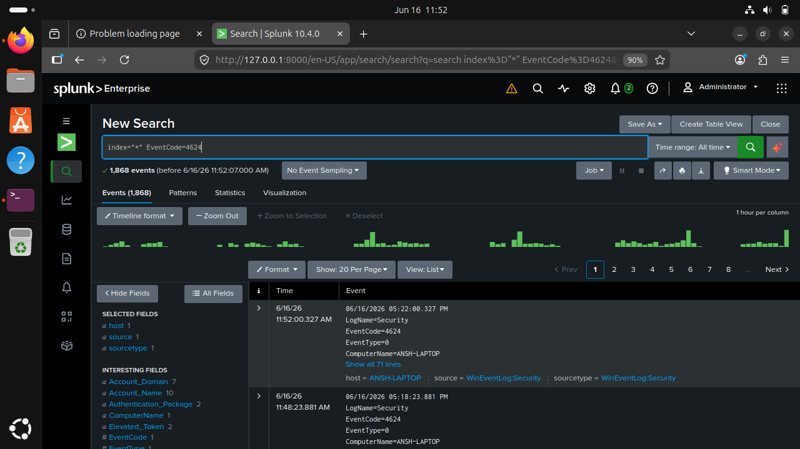

**Result:** 1,868 events from ANSH-LAPTOP, all Security log entries for EventCode 4624 (Successful Logon), with complete field extraction:

```
LogName=Security
EventCode=4624
ComputerName=ANSH-LAPTOP
SourceName=Microsoft Windows security auditing.
Keywords=Audit Success
TaskCategory=User Account Management
Message=An account was successfully logged on.
```

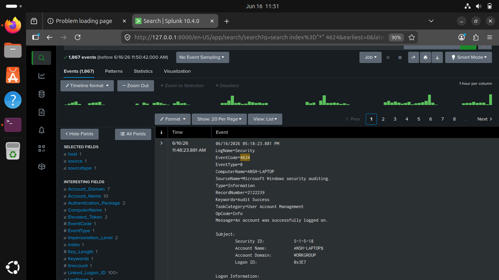

The receiving port, index, and forwarder agent were all functioning correctly. Windows telemetry was confirmed flowing into the SIEM.

---

## Part 4 — TryHackMe SOC Immersive Simulator: Phishing Unfolding (Medium)

### 4.1 Environment

TryHackMe's SOC Immersive Simulator provides a realistic alert queue interface connected to a Splunk 8.2.6 instance. Alerts arrive with associated metadata — datasource, timestamp, severity, and artifact details — and each requires a classification decision (true positive or false positive) along with a structured case report. The Phishing Unfolding scenario presented 35 alerts across five distinct attack stages.

### 4.2 Alert Breakdown

| Category | Alert IDs | Count | Result |
|---|---|---|---|
| DNS Tunneling — High Severity (True Positive) | 1025–1034 | 10 | ✅ Correct |
| Suspicious Parent-Child Process (False Positive) | 1001–1002, 1006–1010, 1012, 1015–1016, 1019, 1021 | 12 | ✅ Correct |
| Suspicious Email from External Domain (False Positive) | 1003–1004, 1011, 1013–1014, 1017–1018 | 7 | ✅ Correct |
| Phishing with Malicious Attachment (True Positive) | 1005 | 1 | ✅ Correct |
| PowerShell Script in Downloads Folder (True Positive) | 1020 | 1 | ✅ Correct |
| Network Drive Staging via PowerShell (True Positive) | 1022, 1024 | 2 | ✅ Correct |
| Suspicious Parent-Child Process (True Positive) | 1023 | 1 | ✅ Correct |
| Suspicious Email from External Domain (Misclassified) | 1000 | 1 | ❌ Incorrect |
| **Total** | | **35** | **34/35** |

### Alert 1001 — Suspicious Parent-Child Process (False Positive)

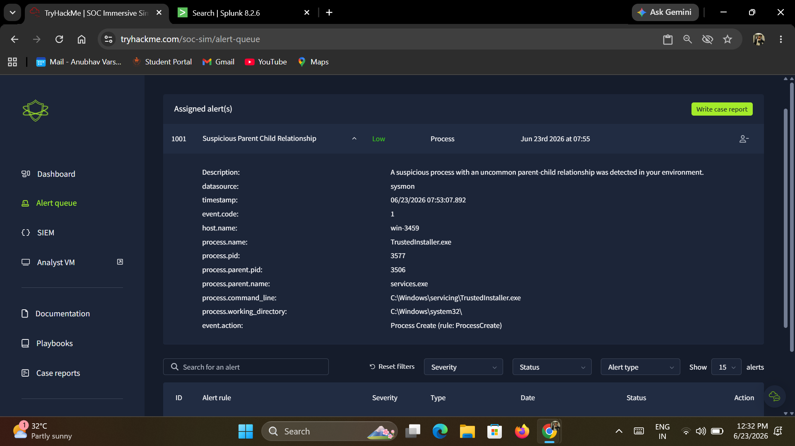

**Datasource:** Sysmon (Event Code 1 — Process Create)
**Host:** win-3459

```
process.name:          TrustedInstaller.exe
process.pid:           3577
process.parent.name:   services.exe
process.parent.pid:    3506
process.command_line:  C:\Windows\servicing\TrustedInstaller.exe
process.working_dir:   C:\Windows\system32\
```

TrustedInstaller.exe is a Windows system component responsible for managing software installation, updates, and protected file operations. It is normally instantiated by services.exe and runs from `C:\Windows\servicing\`. All fields — parent process, command line, working directory — are consistent with standard Windows Update behaviour. No indicators of process masquerading or anomalous execution context were present.

**Classification: False Positive**

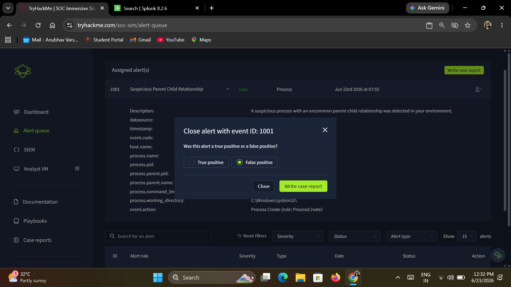

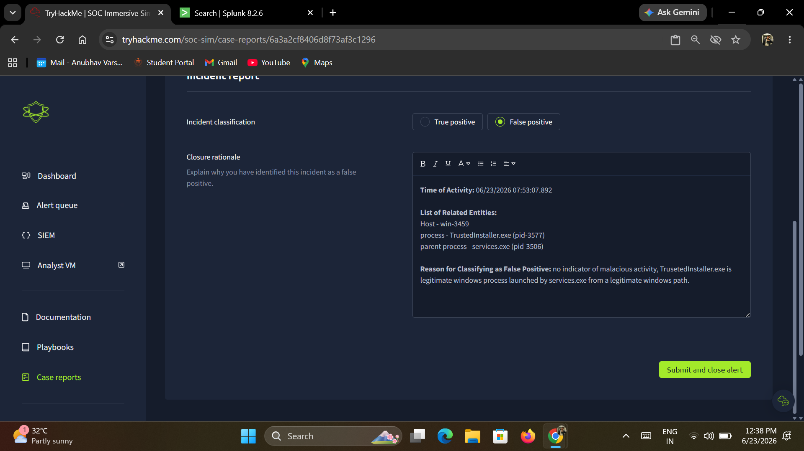

**Case report:**

- **Time of Activity:** 06/23/2026 07:53:07.892
- **List of Related Entities:** Host - win-3459; process - TrustedInstaller.exe (pid-3577); parent process - services.exe (pid-3506)
- **Reason for Classifying as False Positive:** No indicator of malicious activity — TrustedInstaller.exe is a legitimate Windows process launched by services.exe from a legitimate Windows path.

### Alert 1005 — Phishing Email with Malicious Attachment (True Positive)

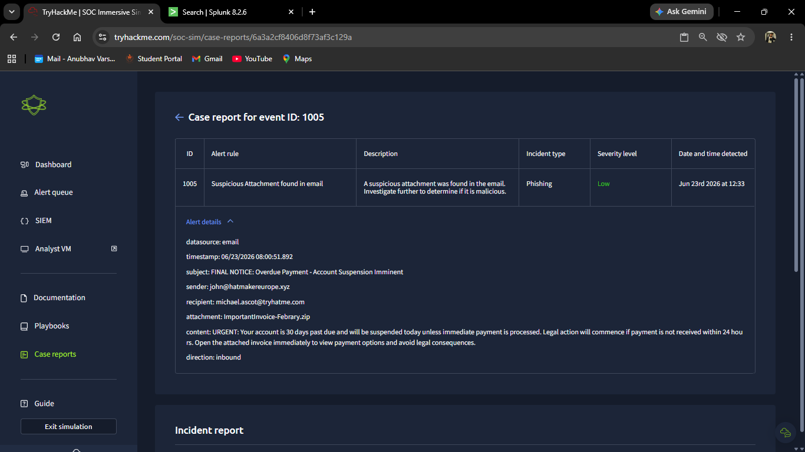

**Datasource:** Email
**Type:** Phishing

```
timestamp:   06/23/2026 08:00:51.892
subject:     FINAL NOTICE: Overdue Payment - Account Suspension Imminent
sender:      john@hatmakereurope.xyz
recipient:   michael.ascot@tryhatme.com
attachment:  ImportantInvoice-Febrary.zip
direction:   inbound
```

**Indicators assessed:**

- **Sender domain** `hatmakereurope.xyz` — external, non-corporate, unrecognised
- **Subject line** — combines financial urgency, account suspension threat, and legal action language; a documented social engineering pattern designed to reduce recipient scrutiny and prompt immediate action
- **Attachment** `ImportantInvoice-Febrary.zip` — ZIP archives are a standard malware delivery mechanism; the misspelling of "February" is consistent with attacker-crafted lures where file names are generated rather than typed by a legitimate business
- **Email body** — instructs recipient to open the attachment immediately under threat of legal consequences within 24 hours; artificial time pressure is a social engineering technique to prevent the recipient from verifying the sender's legitimacy
- **Direction:** inbound from external

**Classification: True Positive — Escalated**

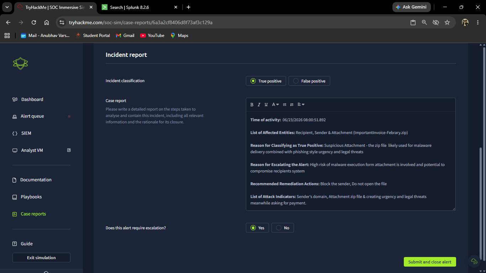

**Case report:**

- **Time of activity:** 06/23/2026 08:00:51.892
- **List of Affected Entities:** Recipient, Sender & Attachment (ImportantInvoice-Febrary.zip)
- **Reason for Classifying as True Positive:** Suspicious attachment — the zip file likely used for malware delivery, combined with phishing-style urgency and legal threats
- **Reason for Escalating the Alert:** High risk of malware execution from attachment involved, with potential to compromise the recipient's system
- **Recommended Remediation Actions:** Block the sender; do not open the file
- **List of Attack Indicators:** Sender's domain; attachment zip file; urgency and legal threats combined with a payment request


### Alerts 1006 & 1009 — rdpclip.exe (False Positive)

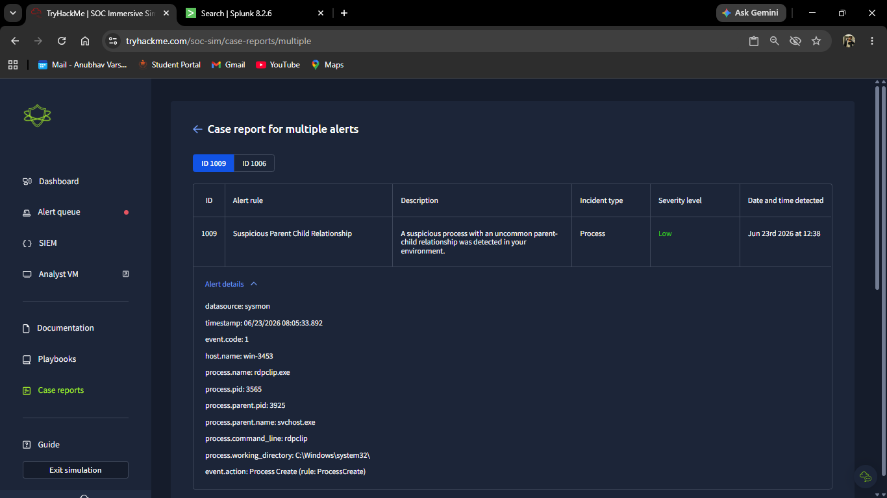

**Datasource:** Sysmon (Event Code 1)
**Host:** win-3453

```
process.name:          rdpclip.exe
process.parent.name:   svchost.exe
process.command_line:  rdpclip
process.working_dir:   C:\Windows\system32\
```

rdpclip.exe is the Remote Desktop Clipboard utility, responsible for clipboard redirection in RDP sessions. It is routinely spawned by svchost.exe during normal remote desktop usage. The process ran from the expected system path with no anomalous arguments.

**Classification: False Positive**

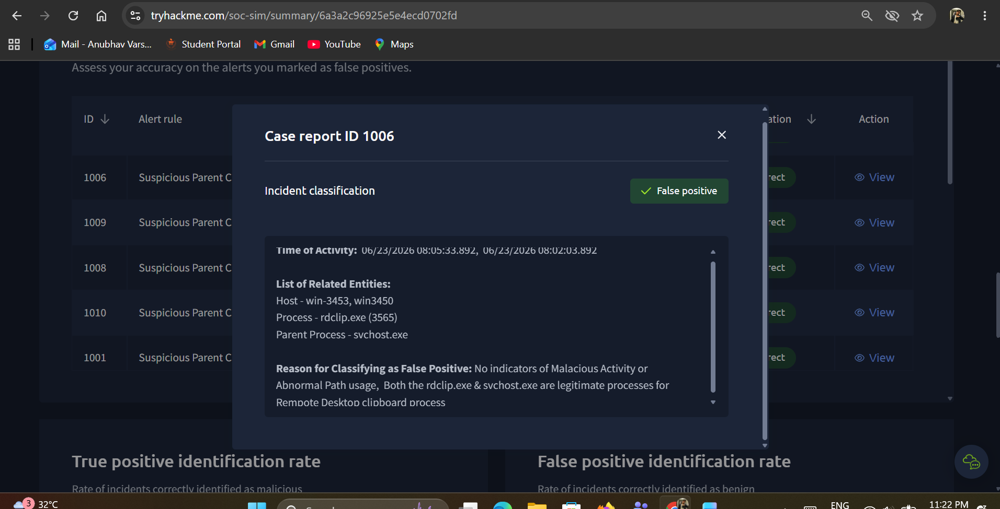

**Case report:**

- **Time of Activity:** 06/23/2026 08:05:33.892, 06/23/2026 08:02:03.892
- **List of Related Entities:** Host - win-3453, win-3450; Process - rdpclip.exe (3565); Parent Process - svchost.exe
- **Reason for Classifying as False Positive:** No indicators of malicious activity or abnormal path usage — both rdpclip.exe and svchost.exe are legitimate processes for the Remote Desktop clipboard function


### Alert 1020 — PowerShell Script in Downloads Folder (True Positive)

**Datasource:** Sysmon
**Type:** Execution
**Host:** win-3450

A PowerShell process was detected executing a script from the user's Downloads directory. Legitimate administrative scripts do not execute from `Downloads\`; this path is associated with user-downloaded content and is a known staging location for delivered payloads. The working directory matched `C:\Users\michael.ascot\downloads\` — the same user and host context appearing across the network drive alerts, indicating this was not an isolated event but part of a broader execution chain on this endpoint.

**Classification: True Positive — Escalated**

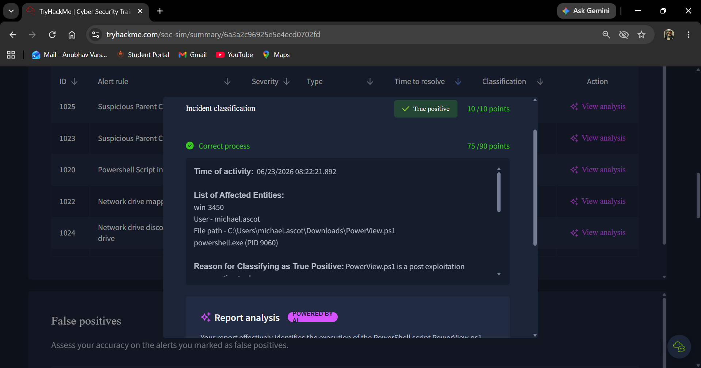

**Case report:**

- **Time of activity:** 06/23/2026 08:22:21.892
- **List of Affected Entities:** win-3450; User - michael.ascot; File path - `C:\Users\michael.ascot\Downloads\PowerView.ps1`; powershell.exe (PID 9060)
- **Reason for Classifying as True Positive:** PowerView.ps1 is a post-exploitation enumeration tool; creation of this script via PowerShell in the Downloads folder
- **Reason for Escalating the Alert:** Indicates potential malicious activity
- **Recommended Remediation Actions:** Remove script from disk; investigate user activity; scan system for additional malicious tools; isolate the host; monitor PowerShell logs
- **List of Attack Indicators:** File - PowerView.ps1; path: `C:\Users\michael.ascot\Downloads`; process.name: powershell.exe; known AD recon tool behaviour

### Alerts 1022 & 1024 — Network Drive Staging via PowerShell (True Positive)

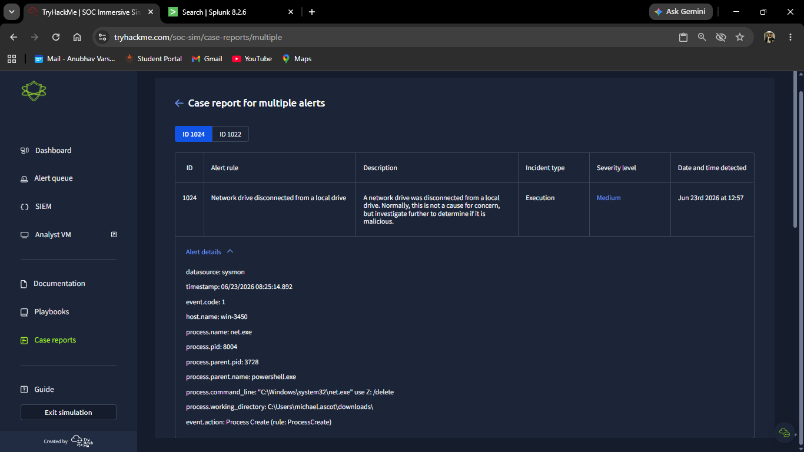

**Datasource:** Sysmon (Event Code 1)
**Type:** Execution
**Severity:** Medium
**Host:** win-3450

These two alerts were generated by the same PowerShell session (PID 3728) operating on win-3450.

Alert 1022 captured net.exe mapping Drive Z to a network share:

```
process.parent.name:   powershell.exe
process.parent.pid:    3728
process.command_line:  net use Z: \\server\SSF-FinancialRecords
process.working_dir:   C:\Users\michael.ascot\downloads\
```

Alert 1024 captured the same PowerShell session removing that mapping minutes later:

```
process.parent.pid:    3728
process.command_line:  "C:\Windows\system32\net.exe" use Z: /delete
process.working_dir:   C:\Users\michael.ascot\downloads\
```

A network share containing financial records was mounted, accessed, and disconnected within a short window using the same parent process. This mount-access-disconnect sequence is consistent with data staging behaviour: files are copied to a local staging location and the share connection is then removed to reduce the forensic trail. The share name SSF-FinancialRecords and the `michael.ascot\downloads\` working directory place this activity within the same execution chain as Alert 1020.

**Classification: True Positive — Escalated**

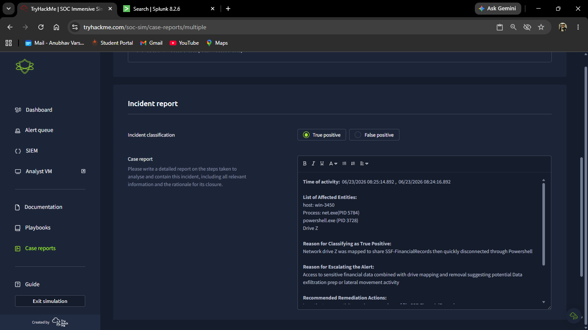

**Case report:**

- **Time of activity:** 06/23/2026 08:25:14.892, 06/23/2026 08:24:16.892
- **List of Affected Entities:** host: win-3450; Process: net.exe (PID 5784); powershell.exe (PID 3728); Drive Z
- **Reason for Classifying as True Positive:** Network drive Z was mapped to share SSF-FinancialRecords, then quickly disconnected through PowerShell
- **Reason for Escalating the Alert:** Access to sensitive financial data combined with drive mapping and removal, suggesting potential data exfiltration prep or lateral movement activity
- **Recommended Remediation Actions:** Investigate user activity; review access logs of file SSF-FinancialRecords; isolate host if suspicious activity continues; review PowerShell command history
- **List of Attack Indicators:** Execution via powershell.exe; sensitive network share access; the command lines used

### Alerts 1025–1034 — DNS Tunnelling / Data Exfiltration (True Positive, High Severity)
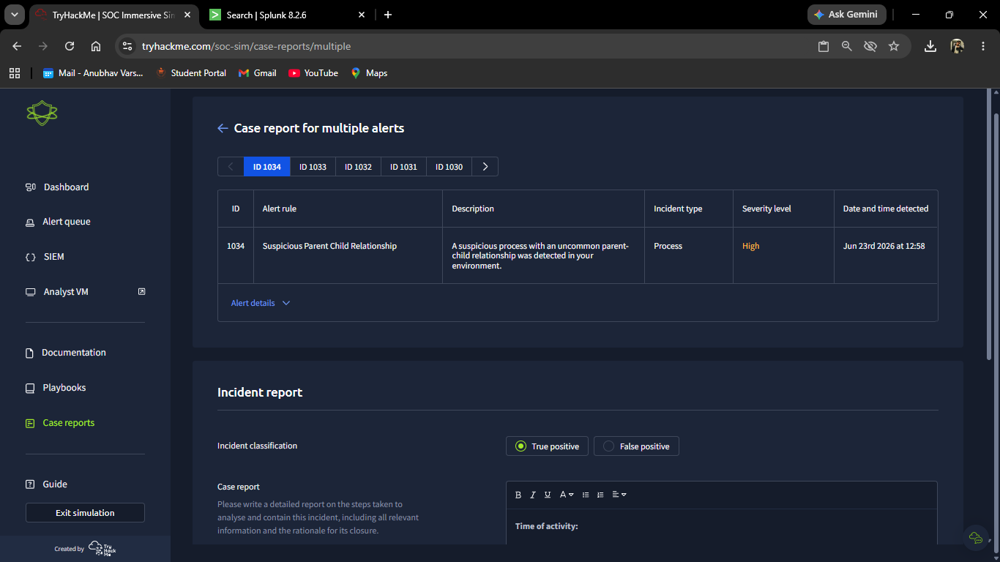

**Datasource:** Sysmon
**Severity:** High
**Host:** win-3450
**User:** michael.ascot

```
process.name:          nslookup.exe
process.parent.name:   powershell.exe
process.parent.pid:    3728
domain queried:        haz4rdw4re.io
```

Ten alerts were generated by repeated nslookup.exe invocations from the same PowerShell session (PID 3728) that executed the network drive activity in Alerts 1022 and 1024. The DNS queries contained Base64-encoded subdomain strings — a characteristic pattern of DNS tunnelling, where data is encoded into DNS query labels to exfiltrate information over a protocol that is rarely inspected at the perimeter. The destination domain `haz4rdw4re.io` had no legitimate business association.

**Reconstructed attack chain:**

1. Phishing email with malicious ZIP attachment delivered to michael.ascot (Alert 1005)
2. Payload execution initiated via PowerShell from `Downloads\` (Alert 1020)
3. Network share SSF-FinancialRecords mounted and accessed (Alert 1022)
4. Share disconnected after data staging (Alert 1024)
5. Staged data exfiltrated via DNS tunnelling to `haz4rdw4re.io` using nslookup.exe (Alerts 1025–1034)
 
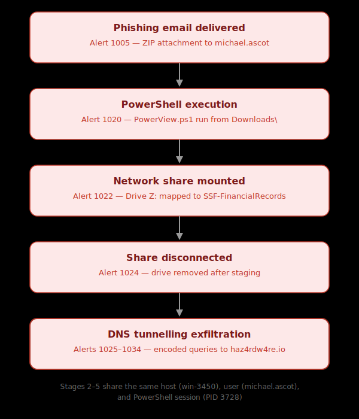
**Diagram 3: Chain Flow Diagram**

All five stages involved the same user (michael.ascot), the same host (win-3450), and the same PowerShell session (PID 3728), confirming a single continuous attack chain from initial access to exfiltration.

**Classification: True Positive — Escalated (High Severity)**

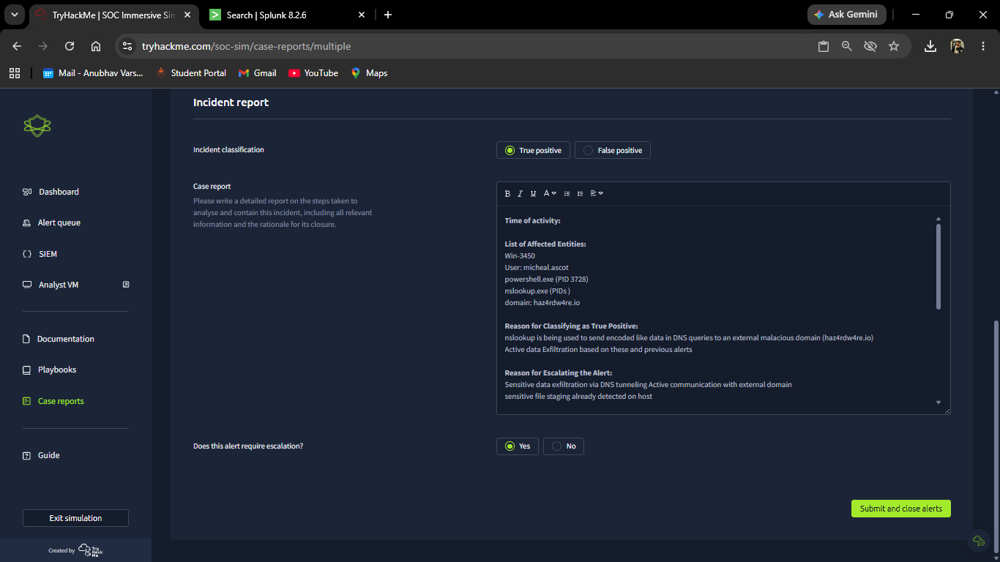


**Case report:**

- **List of Affected Entities:** win-3450; User: michael.ascot; powershell.exe (PID 3728); nslookup.exe (PIDs); domain: haz4rdw4re.io
- **Reason for Classifying as True Positive:** nslookup used to send encoded-looking data in DNS queries to an external malicious domain (haz4rdw4re.io); active data exfiltration based on this and previous alerts
- **Reason for Escalating the Alert:** Sensitive data exfiltration via DNS tunnelling; active communication with an external domain; sensitive file staging already detected on the host
- **Recommended Remediation Actions:** Block domain haz4rdw4re.io at DNS/firewall level; terminate PowerShell and nslookup processes; reset credentials for the user michael.ascot; preserve forensic image of disk and memory; isolate the host win-3450
- **List of Attack Indicators:** nslookup.exe used with encoded subdomains; domain haz4rdw4re.io; Base64-like DNS query patterns; execution from powershell.exe; repeated automated DNS requests; path `downloads\exfiltration\`; prior Robocopy staging activity; suspicious DNS tunnelling behaviour

### 4.4 False Positive Triage

Of the 35 alerts, 19 were false positives. These fell into two categories: inbound emails from external domains that matched phishing detection rules but lacked payload, sender spoofing, or social engineering indicators sufficient to warrant escalation; and Windows system processes triggering parent-child relationship rules despite running from legitimate system paths with expected arguments.

Correctly dismissing these requires familiarity with standard Windows process behaviour — specifically, knowing which parent-child process relationships are normal for a given operating context and which represent anomalies. It also requires applying consistent triage criteria to phishing alerts rather than escalating on surface-level pattern matches alone.

18 of the 19 false positives were correctly dismissed. **Alert 1000** — a suspicious email from an external domain — was incorrectly classified as a true positive. The email matched several phishing surface indicators but lacked the payload and manipulation tactics that characterised Alert 1005. The correct classification was false positive. This misclassification accounts for the 95% false positive accuracy in the final score.

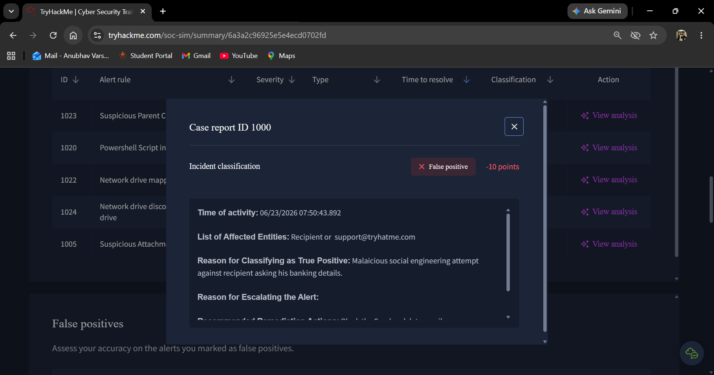

**Case report (submitted, later found incorrect):**

- **Time of activity:** 06/23/2026 07:50:43.892
- **List of Affected Entities:** Recipient or support@tryhatme.com
- **Reason given for classifying as True Positive:** Malicious social engineering attempt against recipient asking for banking details
- **Recommended Remediation Actions:** Block the sender; delete email
- **List of Attack Indicators:** eileen@trendymillineryco.me; requesting banking details

---

## Final Results

| Metric | Result |
|---|---|
| Score | 1,425 points |
| True Positive Rate | 100% |
| False Positive Accuracy | 95% |
| Alerts Closed | 35 |
| Mean Time to Resolve | 9 minutes |
| Mean Dwell Time | 131 minutes |

---

## Skills and Technical Understanding

| Skill | Evidence |
|---|---|
| Linux system administration | Ubuntu environment setup, package management, network configuration, service management |
| SIEM deployment and configuration | Splunk Enterprise 10.4.0 installed from package, receiving port configured, dedicated index created |
| Endpoint agent deployment | Universal Forwarder installed on Windows 11, all Event Log channels selected, index routing confirmed |
| Windows Event Log analysis | 1,868 EventCode=4624 events ingested and validated via SPL query |
| Alert triage and classification | 35 alerts triaged across phishing, process, execution, and exfiltration categories |
| Phishing email analysis | Sender domain assessment, attachment risk evaluation, social engineering pattern identification |
| Process anomaly detection | Distinguishing legitimate Windows system processes from anomalous parent-child relationships |
| PowerShell execution detection | Non-standard execution path identification; correlation with concurrent host activity |
| Lateral movement detection | Network drive mapping to sensitive shares via PowerShell identified and correlated |
| DNS tunnelling identification | Recognized Base64-encoded subdomain pattern and external C2 domain (as surfaced by simulator alert data) and correlated it with the prior PowerShell/staging activity to confirm exfiltration |
| Incident reporting | Structured case reports produced for each escalated alert including TTPs, affected entities, IOCs, and remediation steps |
| Attack chain reconstruction | Five-stage kill chain linked across phishing delivery, payload execution, data staging, and DNS exfiltration |

---

## SOC Tier Relevance

- **Tier 1:** Alert queue management, true/false positive classification, initial triage and case documentation
- **Tier 2:** Multi-alert correlation, attack chain reconstruction, lateral movement analysis, escalation decisions
- **Exposure to Tier 2/3-level techniques:** DNS tunnelling recognition, forensic preservation reasoning, and host isolation procedures, practiced in a guided simulation context

---

## Conclusion

This project covers the full operational cycle of a basic SOC environment: infrastructure deployment, log pipeline configuration, endpoint telemetry ingestion, and alert-driven investigation. The TryHackMe simulation tested triage accuracy across a realistic alert volume that included both genuine attack activity and intentional noise in the form of benign process and email alerts. Maintaining accuracy across both — escalating what required escalation and dismissing what did not — is the core operational challenge the simulation was designed to assess.

The attack chain identified across the Phishing Unfolding scenario — from initial email delivery through PowerShell execution, financial data staging, and DNS-based exfiltration — demonstrates how individual low-severity alerts, taken in isolation, can be misleading. The investigation methodology applied here treated alerts as correlated data points rather than independent events, which was necessary to reconstruct the full chain and identify the correct scope of the incident.

**Platform:** TryHackMe SOC Immersive Simulator | Splunk Enterprise 10.4.0 | Ubuntu | Windows 11

`#Splunk` `#SOC` `#SIEM` `#CyberSecurity` `#BlueTeam` `#TryHackMe` `#IncidentResponse` `#ThreatHunting` `#SOCAnalyst` `#Phishing` `#DNSTunneling` `#LogAnalysis` `#InfoSec`
